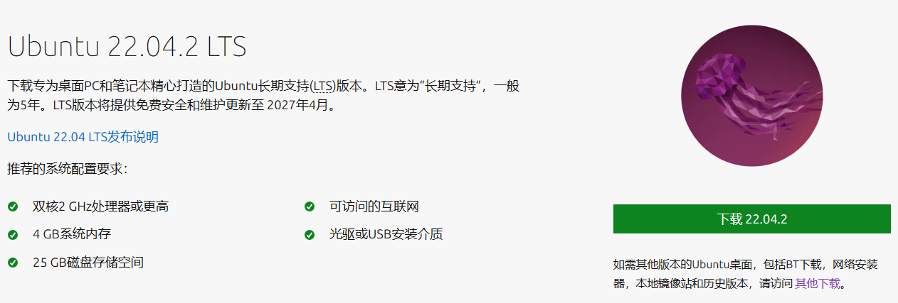
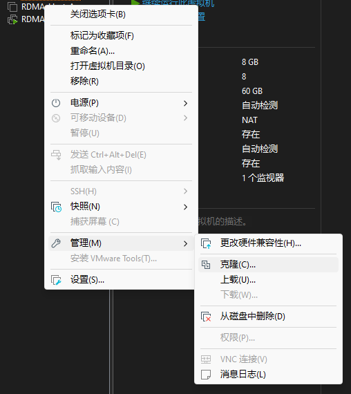
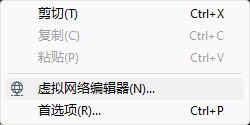
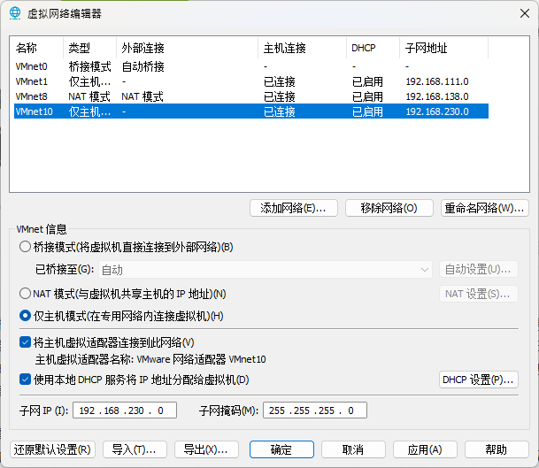
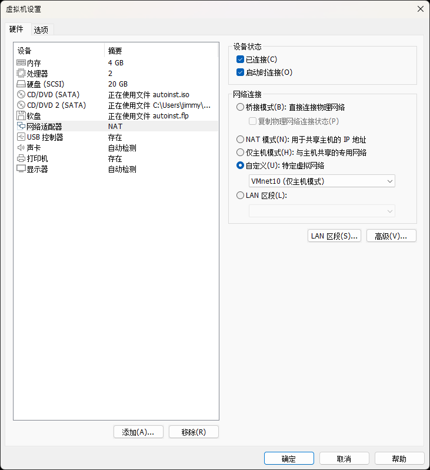
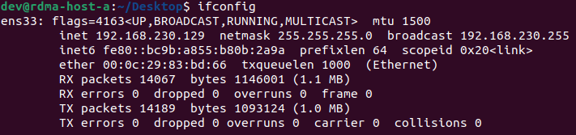
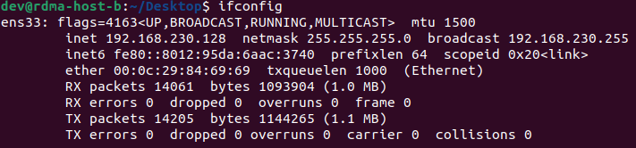
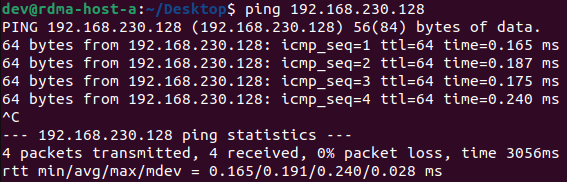
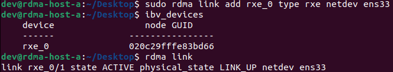
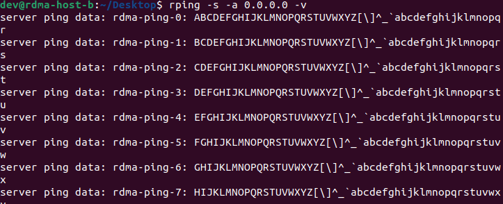

# 配置 RDMA 本地运行环境

这篇文档会介绍 RDMA 本地运行环境的配置流程。

## 步骤1：安装虚拟机

1. 首先下载 Ubuntu 22.04 [下载Ubuntu桌面系统 | Ubuntu](https://cn.ubuntu.com/download/desktop)

   

2. 使用 VMware 安装虚拟机

## 步骤2：安装所需组件

1. 安装 iproute2：`sudo apt-get install iproute2`
2. 配置 RDMA工具链：因为 Ubuntu 22.04 已经集成了 RDMA 内核态驱动，只需要安装部分用户态驱动即可。执行 `sudo apt-get install libibverbs1 ibverbs-utils librdmacm1 libibumad3 ibverbs-providers rdma-core`
3. 安装 RDMACM 工具包：`sudo apt install rdmacm-utils`，里面的 `rping` 工具后面会用来进行 RDMA 配置结果的验证

## 步骤3：克隆虚拟机

因为 RDMA 开发需要使用两台主机，这里使用 VMware 提供的虚拟机克隆功能。

链接克隆即可

## 步骤3：配置虚拟网络

我这里两台主机名分别为 rdma-host-a 和 rdma-host-b，我们使用 Soft-RoCE 进行开发，所以只需要使两台主机可以基于以太网相互访问即可（毕竟本地开发也不可能用几十万一套的 IB 硬件）

使用 VMware 虚拟网络编辑器

这里建立了一个仅主机的网络 VMnet10

将两台虚拟机配置进该网络

使用 ifconfig 和 ping 大概检查一下两台主机的网络连通性

这样网络就配置 ok 了，记住设备名称，我这里两台设备都是 `ens33`

## 步骤4：配置 Soft-RoCE 设备

步骤四也需要在两台主机分别完成。

1. 需要加载内核驱动，modprobe会自动加载依赖的其他驱动：`sudo modprobe rdma_rxe`

2. 在刚才配置的虚拟网卡 `ens33` 上添加 Soft-RoCE 设备：`sudo rdma link add rxe_0 type rxe netdev ens33`

3. 配置结果：

   

在两台设备各创建 Soft-RoCE 设备后，RDMA 配置就算是完成了。

验证一下配置结果：

1. 在 rdma-host-b 主机上启动 rping 服务端：`rping -s -a 0.0.0.0 -v`
2. 在 rdma-host-a 主机上启动 rping 客户端：`rping -c -a 192.168.230.128`

可以看到这样的结果即可。

## （可选）步骤5：文件共享

RDMA 的开发需要在两台主机下进行，日常开发挺麻烦的，所以这里可以配置一下文件共享，把一台主机上 git 仓库的代码直接同步更新到另一台主机上，降低开发难度。

这里可以使用 sshfs 完成，把 rdma-host-a 当作开发机，工作目录挂载到 rdma-host-b 主机上。

这里的配置不再赘述。

---

至此，Soft-RoCE 的本地开发环境配置完成，可以开搞了~

开发工作可以在虚拟机外使用 Visual Studio Code 远程连接到虚拟主机完成，当然也可以在 rdma-host-a 上使用 CLion 等 IDE 完成。

具体的开发环境配置方案将在后续的文档中介绍。